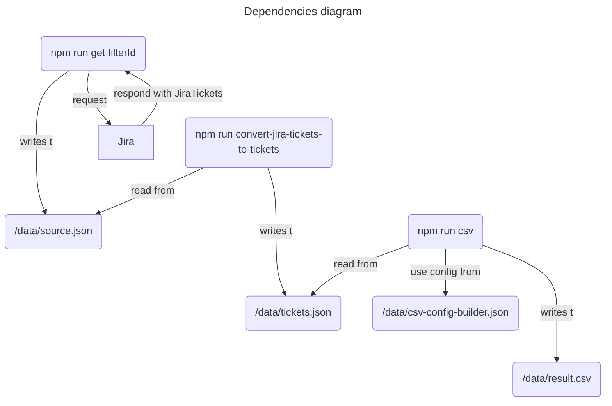

# Curious Goran

- Request data from Jira based on particular filter ID
- Create a CSV file with time statistics (in days or hours) on every ticket and count how many times ticket switched from one status to another.

---

## Setup

### Authentication

[_read more here_](https://developer.atlassian.com/cloud/jira/platform/basic-auth-for-rest-apis/#supply-basic-auth-headers)

1. Create a token https://id.atlassian.com/manage-profile/security/api-tokens
2. Encode it `echo -n user@example.com:api_token_string | base64`
3. Put the token to `.env` file as `JIRA_TOKEN_BASE_64` (check `.env.example` file)

### Base URL

4. Add base URL to `.env` file as `JIRA_BASE_URL` (check `.env.example` file)

### CSV build config
*Curious Goran will add "key" and "title" to resulted CSV. So you shouldn't use this fileds in the csv-build-convig.json*
1. Check `/data/csv-build-config.example.json` file.
2. Add your own statuses to the csv in the order you would like.
3. Rename `csv-build-config.example.json` to `csv-build-config.json`

### Curious Goran config (optional)

8. Check `/src/config.ts` file. There you will find the configuration for Curious Goran. If you need it, change fields in a way you like it.

---

## Request data
<!-- TODO(improvement): write a goran npm script -->
1. Run `npm run goran <Jira filterId>` (example: `npm run goran 666`)

## How does it work?
### Getting JiraTickets from Jira
1. Run `npm run get <Jira filterId>` (example: `npm run get 666`)
2. Script will go through all pages, collect all JiraTickets data and put them to `./data/source.json`
### Convert JiraTickets to Tickets
*Ticket is a simplified version of a JiraTicket*
1. Run `npm run convert-jira-tickets-to-tickets`
2. Script will convert JiraTickets to Tickets and put them to `tickets.json`
### Build CSV
1. Run `npm run csv`
2. Script will get data from `./data/tickets.json` (where the Tickets is placed)
3. Filter out necessary data based on `data/csv-build-config.json`
4. Convert it to CSV with proper structure and put the result to the `./data/result.csv` file.

### Diagrams
```mermaid
---
title: Communication diagram
---
sequenceDiagram
    npm run get filterId->>Jira:request JiraTickets from Jira
    Jira->>npm run get filterId:respond with JiraTickets
    npm run get filterId->>/data/source.json: save to file
    npm run convert-jira-tickets-to-tickets->>/data/source.json: read file
    npm run convert-jira-tickets-to-tickets->>/data/tickets.json: save to file
    npm run csv->>/data/tickets.json: read file
    npm run csv->>/data/tickets.csv: save to file
```
